# 🔍 Análisis Completo — FezTime Appointment SaaS

> **Fecha del análisis:** 2026-05-18
> **Stack:** Next.js 16 + React 19 + MongoDB (Mongoose 9) + NextAuth v4 + MercadoPago + TailwindCSS v4
> **Deployment:** Vercel

---

## 📊 Resumen Ejecutivo

FezTime es un SaaS de turnos online bien planteado para el mercado argentino de estética/barbería. La arquitectura base es correcta y las 7 fases de optimización documentadas muestran madurez en el proceso de desarrollo. Sin embargo, hay **bloqueantes de producción** en seguridad, observabilidad y resiliencia que deben resolverse antes de un lanzamiento real.

| Área | Estado | Prioridad |
|------|--------|-----------|
| Funcionalidad core | ✅ Sólida | — |
| Seguridad | 🔴 Crítico | P0 |
| Observabilidad/Logging | 🔴 Crítico | P0 |
| Auth & Session | 🟡 Riesgo medio | P1 |
| Data Model & DB | 🟡 Mejoras necesarias | P1 |
| Frontend/UX | 🟢 Bueno | P2 |
| Testing | 🔴 Inexistente | P1 |
| DevOps/Infra | 🟡 Incompleto | P1 |
| Billing | 🟡 Funcional con riesgos | P1 |
| PWA | 🟡 Básico | P3 |

---

## ✅ Lo que Está Bien

### 1. Arquitectura Multi-tenant Correcta
- Todos los endpoints admin usan `getCurrentBusiness()` que valida sesión + `ownerUserId`
- Queries están scoped por `businessId` en todos los modelos
- Endpoints públicos resuelven por slug, no por IDs expuestos internos
- Índices compuestos apropiados en `Appointment`, `ScheduleDay`, `Service`

### 2. Flujo de Turnos Completo
- El ciclo `request → confirm → remind → reject/cancel/reschedule` está implementado
- Validación de solapamiento server-side tanto en booking público como en reschedule admin
- Magic links con `clientToken` para que clientes gestionen sus turnos
- Integración WhatsApp via URL scheme (pragmático y funcional)

### 3. Slug System Robusto
- Validación centralizada ([slug.ts](file:///e:/Backup/Programacion/FezTime/appointment-saas/lib/slug.ts)): formato, longitud, reservados, ofensivos
- `previousSlugs` para compatibilidad de URLs históricas con redirect canónico
- Generación determinística de slugs únicos en el registro

### 4. API Design Consistente
- Patrón uniforme: `apiError()` helper + try/catch con error codes
- Endpoints by-id validan ownership con `businessId`
- Respuestas JSON consistentes con shapes predecibles

### 5. Landing y Branding Customizable
- `BusinessSettings` permite personalizar colores, fondo, logo, textos, redes
- Landing pública adapta apariencia según configuración del negocio
- Dashboard respeta el theming del negocio (`BrandConfig`)

### 6. Proceso de Optimización Documentado
- [OPTIMIZATION_PHASES.md](file:///e:/Backup/Programacion/FezTime/appointment-saas/OPTIMIZATION_PHASES.md) es un documento excelente de tracking
- 7 fases completadas con métricas, registro de archivos y backlog

---

## 🔴 Problemas Críticos (Bloqueantes para Producción)

### 1. SEGURIDAD — `.env` con Secrets en Repositorio

> [!CAUTION]
> El archivo `.env` contiene credenciales **reales de producción** en texto plano:
> - Contraseña de MongoDB Atlas
> - `NEXTAUTH_SECRET` real
> - `MP_ACCESS_TOKEN_PROD` de MercadoPago
>
> Aunque `.gitignore` excluye `.env*`, el archivo existe localmente con datos de producción. Si alguna vez se comitió, los secrets están comprometidos.

**Acción inmediata:**
- [ ] Rotar TODOS los secrets: MongoDB password, NEXTAUTH_SECRET, MP tokens
- [ ] Verificar con `git log --all --full-history -- .env` que nunca se comitió
- [ ] Usar Vercel Environment Variables exclusivamente para producción

---

### 2. SEGURIDAD — Sin Rate Limiting en Endpoints Públicos

> [!CAUTION]
> Los endpoints `/api/public/[slug]/appointments` y `/api/public/[slug]/availability` no tienen rate limiting. Un atacante puede:
> - **Spam de turnos**: crear cientos de solicitudes falsas inundando la agenda
> - **DoS**: bombardear `/availability` que hace 3 queries a MongoDB por request
> - **Scraping**: enumerar negocios y servicios

**Acciones:**
- [ ] Implementar rate limiting (ej: [Vercel KV](https://vercel.com/docs/storage/vercel-kv) + sliding window, o `@upstash/ratelimit`)
- [ ] Limitar a ~10 bookings por IP/hora y ~60 availability checks por IP/minuto
- [ ] Considerar captcha o honeypot en el form de booking

---

### 3. SEGURIDAD — Sin Middleware de Auth para Rutas Protegidas

> [!WARNING]
> No existe `middleware.ts` en el proyecto. Las rutas `/dashboard`, `/billing`, y todos los endpoints `/api/admin/*` dependen **exclusivamente** de que cada handler llame a `getCurrentBusiness()`.
>
> Si un developer olvida llamarlo en un endpoint nuevo, queda completamente abierto.

**Acciones:**
- [ ] Crear `middleware.ts` que proteja `/dashboard`, `/billing`, `/api/admin/*` a nivel de routing
- [ ] El middleware debe verificar la sesión JWT y redirigir a `/login` si no hay sesión

---

### 4. SEGURIDAD — Sin Sanitización de Inputs del Cliente

> [!WARNING]
> Los campos `clientName`, `clientPhone`, `notes` se guardan directamente en MongoDB sin sanitización. Vectores de ataque:
> - **NoSQL Injection**: si bien Mongoose mitiga parcialmente, no hay validación explícita
> - **XSS almacenado**: si `notes` o `clientName` contienen HTML/JS y se renderizan sin escape en algún contexto futuro (ej: email, exportación)
> - **WhatsApp message injection**: un `clientName` con caracteres especiales puede alterar el mensaje de WhatsApp

**Acciones:**
- [ ] Sanitizar y validar longitudes máximas en todos los inputs del público
- [ ] Validar formato de `clientPhone` (regex argentino)
- [ ] Strip HTML tags de `notes`

---

### 5. SEGURIDAD — Webhook sin Verificación de Firma

> [!CAUTION]
> El webhook de MercadoPago en [route.ts](file:///e:/Backup/Programacion/FezTime/appointment-saas/app/api/billing/mp/webhook/route.ts) **no verifica la firma HMAC** del request. Cualquier persona que conozca la URL puede enviar webhooks falsos para:
> - Activar negocios sin pago real
> - Cambiar `status` a `active` y `paidUntil` arbitrariamente

**Acción:**
- [ ] Implementar verificación de firma HMAC de MercadoPago usando `x-signature` header

---

## 🟡 Problemas Importantes (Pre-Producción)

### 6. Auth Duplicada — Dos Configuraciones NextAuth

Hay **dos** configuraciones de NextAuth coexistiendo:
- [auth.ts (root)](file:///e:/Backup/Programacion/FezTime/appointment-saas/auth.ts) — usa NextAuth v5 API (`NextAuth()` directo)
- [route.ts](file:///e:/Backup/Programacion/FezTime/appointment-saas/app/api/auth/%5B...nextauth%5D/route.ts) — usa NextAuth v4 API (`NextAuth(authOptions)`)

Y hay dos archivos de re-export:
- [lib/auth.ts](file:///e:/Backup/Programacion/FezTime/appointment-saas/lib/auth.ts) — usa `getServerSession(authOptions)` (v4 pattern)
- Root `auth.ts` — exporta `auth` de v5

Esto causa **confusión** y puede llevar a inconsistencias. Se debe unificar en una sola versión.

---

### 7. Modelo `Settings` Legacy No Eliminado

El modelo [Settings.ts](file:///e:/Backup/Programacion/FezTime/appointment-saas/lib/models/Settings.ts) tiene un campo hardcodeado `owner: 'hermana'` — claramente un vestigio del desarrollo inicial single-tenant. 

El archivo [lib/appointments.ts](file:///e:/Backup/Programacion/FezTime/appointment-saas/lib/appointments.ts) **todavía usa** `Settings.findOne({ owner: 'hermana' })` en `getAvailability()`. Aunque este endpoint legacy devuelve 410, el código sigue importando y usando el modelo incorrecto.

**Acción:** Eliminar `Settings.ts` y `lib/appointments.ts` si ya no se usan en ningún flujo activo.

---

### 8. Sin Tests de Ningún Tipo

> [!IMPORTANT]
> No existe **ningún** test unitario, de integración, ni E2E en el proyecto. Para un SaaS que maneja pagos y turnos de negocios reales, esto es un riesgo alto.

**Prioridades de testing:**
1. **Unit tests** para: `slug.ts`, `time.ts`, `whatsapp.ts`, lógica de availability
2. **Integration tests** para: flujo de booking, webhook de pagos, auth
3. **E2E** (Playwright/Cypress): flujo completo de registro → crear servicio → booking → confirm

---

### 9. Checkout Price Inconsistency

En [checkout/route.ts](file:///e:/Backup/Programacion/FezTime/appointment-saas/app/api/billing/mp/checkout/route.ts):
```typescript
const PRICE_BASIC = 100; // $10.000 ARS
```
El comentario dice `$10.000` pero el valor es `100`. MercadoPago usa **unidades enteras** (no centavos) para ARS. Esto cobraría **$100 ARS** en vez de **$10.000 ARS**.

**Acción:** Verificar y corregir el precio. Si quieres cobrar $10.000, el valor debe ser `10000`.

---

### 10. Sin Enforcement de Trial/Subscription

El campo `Business.status` existe con valores `trial/active/past_due/cancelled`, pero **no se verifica en ningún lugar**. Un negocio con `status: 'cancelled'` o trial vencido puede seguir usando el sistema normalmente.

**Acciones:**
- [ ] Crear middleware o helper que verifique `status` y `paidUntil` antes de permitir acceso al dashboard
- [ ] Definir qué se bloquea: ¿solo dashboard? ¿también booking público?
- [ ] Mostrar banner de "trial vencido" con CTA a billing

---

### 11. `console.log` en Producción

En [BusinessLandingClient.tsx](file:///e:/Backup/Programacion/FezTime/appointment-saas/app/%5Bslug%5D/BusinessLandingClient.tsx#L31):
```typescript
console.log('settings:', settings);
```
Queda un `console.log` de debug en código de producción que expone la configuración del negocio en la consola del navegador del cliente.

---

### 12. Service Worker Pre-cachea Ruta Inexistente

En [sw.js](file:///e:/Backup/Programacion/FezTime/appointment-saas/public/sw.js):
```javascript
const URLS_TO_CACHE = [
  '/',
  '/turnos',  // ← Esta ruta es legacy y devuelve 410 o redirect
  '/favicon.ico',
  '/manifest.webmanifest'
];
```

---

### 13. `proxy.ts` — Archivo Muerto

El archivo [proxy.ts](file:///e:/Backup/Programacion/FezTime/appointment-saas/proxy.ts) en la raíz no es un middleware de Next.js ni se importa en ningún lugar. Es código muerto.

---

### 14. `dashboard.zip` en el Directorio `app/`

Hay un archivo [dashboard.zip](file:///e:/Backup/Programacion/FezTime/appointment-saas/app/dashboard.zip) de 26KB dentro del directorio app. Probablemente un backup que no debería estar en el proyecto.

---

## 🟢 Mejoras Recomendadas (Post-lanzamiento)

### 15. Error Handling Global
Implementar `error.tsx` y `not-found.tsx` a nivel de layout para manejar errores de forma consistente en vez de depender del fallback default de Next.js.

### 16. Notificaciones Push al Admin
Cuando un cliente solicita un turno, el admin solo se entera si entra al dashboard. Implementar:
- Web Push notifications (el Service Worker ya está)
- O al menos notificación por WhatsApp al número del negocio

### 17. Timezone Awareness
Todo el sistema usa strings `"YYYY-MM-DD"` y `"HH:mm"` sin timezone explícita. Para Argentina esto funciona, pero:
- `new Date(\`${date}T00:00:00\`)` se interpreta en UTC en algunos entornos
- Si el negocio está en una zona horaria distinta al servidor, los slots se calculan mal

**Recomendación:** Almacenar timezone del negocio y usar `Intl.DateTimeFormat` o `date-fns-tz`.

### 18. Observabilidad Estructurada
Los `console.error` y `console.log` esparcidos no escalan. Implementar:
- Logger estructurado (ej: `pino` o Vercel's built-in logging)
- Tracing con `x-request-id`
- Error tracking (Sentry o similar)
- Monitoreo de DB (Mongoose queries lentas)

### 19. Cacheo de Availability
El endpoint de availability hace 3 queries por request (business + service + schedule + appointments). Para landing pages con mucho tráfico:
- Cache HTTP con `Cache-Control: s-maxage=60` en Vercel
- O cache a nivel de aplicación con Vercel KV

### 20. Email de Bienvenida y Recuperación de Password
No hay flujo de:
- Email de verificación al registrarse
- Recuperación de contraseña ("Olvidé mi clave")
- Email de bienvenida con guía de setup

Esto es **esperado** por cualquier usuario de un SaaS.

### 21. Múltiples Locales / Profesionales
El modelo actual es 1 usuario = 1 negocio. Para escalar:
- Soporte de roles (admin, profesional, recepcionista)
- Múltiples locales por negocio
- Agenda por profesional

### 22. Responsive del Dashboard
El dashboard usa `max-w-md md:max-w-3xl` — funciona bien en mobile y tablet pero podría aprovechar mejor pantallas desktop con sidebar + content layout.

---

## 📋 Checklist de Producción (Ordenado por Prioridad)

### P0 — Bloqueantes
- [ ] **Rotar secrets** comprometidos en `.env`
- [ ] **Rate limiting** en endpoints públicos
- [ ] **Verificación de firma** en webhook de MercadoPago
- [ ] **Middleware de auth** para rutas protegidas
- [ ] **Corregir precio** del checkout ($100 vs $10.000)

### P1 — Alta prioridad
- [ ] **Sanitización** de inputs de clientes
- [ ] **Enforcement** de trial/subscription status
- [ ] **Unificar** configuración de NextAuth (v4 vs v5)
- [ ] **Eliminar** código muerto (`Settings.ts`, `proxy.ts`, `lib/appointments.ts`, `dashboard.zip`)
- [ ] **Tests** mínimos para flujos críticos
- [ ] **Flujo de password recovery**
- [ ] **Email de verificación** al registrarse

### P2 — Importantes
- [ ] Quitar `console.log` de debug
- [ ] Arreglar Service Worker con rutas correctas
- [ ] Implementar `error.tsx` / `not-found.tsx`
- [ ] Observabilidad (logging estructurado, Sentry)
- [ ] Timezone awareness

### P3 — Nice to have
- [ ] Notificaciones push al admin
- [ ] Cacheo de availability
- [ ] Mejoras de responsive en desktop
- [ ] Dashboard analytics (turnos por día, tasa de confirmación, etc.)

---

## 🏗️ Arquitectura Actual (Diagrama)

```mermaid
graph TB
    subgraph "Frontend (Next.js SSR + Client)"
        LP["Landing Page /"]
        REG["Register /register"]
        LOGIN["Login /login"]
        DASH["Dashboard /dashboard"]
        BILING["Billing /billing"]
        PUB["Public /:slug"]
        BOOK["Booking /:slug/turnos"]
        MAGIC["Magic Link /r/:token"]
    end

    subgraph "API Routes"
        AUTH["/api/auth NextAuth"]
        API_REG["/api/register"]
        API_ADMIN["/api/admin/*"]
        API_PUB["/api/public/:slug/*"]
        API_BILLING["/api/billing/mp/*"]
        API_CLIENT["/api/client/*"]
    end

    subgraph "Data Layer"
        MONGO[(MongoDB Atlas)]
        MP["MercadoPago API"]
    end

    subgraph "External"
        WA["WhatsApp URL Scheme"]
        VERCEL["Vercel Edge"]
    end

    LP --> REG
    LP --> LOGIN
    LOGIN --> AUTH
    REG --> API_REG
    DASH --> API_ADMIN
    BILING --> API_BILLING
    PUB --> BOOK
    BOOK --> API_PUB
    MAGIC --> API_CLIENT

    API_ADMIN --> MONGO
    API_PUB --> MONGO
    API_BILLING --> MP
    API_BILLING --> MONGO
    API_REG --> MONGO
    API_ADMIN -.-> WA

    style LP fill:#1e293b
    style MONGO fill:#10b981,color:#000
    style MP fill:#009ee3,color:#fff
```


